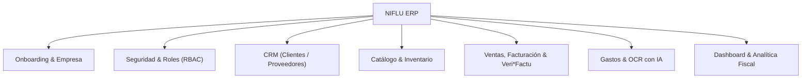

# NIFLU — ERP Web Moderno para PYMEs y Autónomos

> **Proyecto de Fin de Grado (TFG)**  
> **Ciclo Formativo:** C.F.G.S. Desarrollo de Aplicaciones Web (DAW)  
> **Centro:** Atlántida Formación  
> **Curso Académico:** 2026-2027  

---

## 1. Descripción del Proyecto

**NIFLU** es un sistema ERP (*Enterprise Resource Planning*) basado en web, concebido para ofrecer a autónomos y pequeñas empresas una herramienta de gestión integral, ultrarrápida, intuitiva y visualmente moderna.

Inspirado en la versatilidad y modularidad de plataformas como **Odoo**, NIFLU reimagina la experiencia de usuario eliminando el exceso de configuraciones complejas (*bloatware*) y sustituyendo las interfaces pesadas por una experiencia ágil de última generación inspirada en herramientas como **Linear** y **Notion**. 

Además, NIFLU aborda de forma nativa la normativa fiscal española vigente (**Veri\*Factu / Ley Antifraude**) y aprovecha la inteligencia artificial multimodal a coste cero para automatizar la contabilidad diaria.

---

## 2. Análisis Comparativo: NIFLU vs. Odoo

| Característica | Odoo Community | NIFLU ERP |
| :--- | :--- | :--- |
| **Curva de aprendizaje** | Elevada; menús profundos y configuraciones complejas | Inmediata; asistente *Zero-Config* y navegación por teclado |
| **Rendimiento / Interfaz** | Pesada (vistas monolíticas con latencia RPC) | Ultrarrápida; SPA en Next.js con paleta global `Ctrl + K` |
| **Adaptación Legal Española** | Requiere módulos de terceros complejos o versión Enterprise | Integración nativa de **Veri\*Factu** (Hash encadenado y QR oficial) |
| **Contabilidad y Gastos** | Limitada en Community (requiere Enterprise de pago) | OCR gratuito de tickets con IA (Gemini Flash) |
| **Comunicación comercial** | Enfoque en email tradicional | Envío directo en 1 clic a **WhatsApp Web / App** |
| **Costes de implantación** | Altos (servidores pesados, licencias o mantenimiento) | **Coste 0€** (despliegue en la nube, APIs gratuitas) |

---

## 3. Factores Diferenciadores Clave

NIFLU destaca en el mercado gracias a 5 pilares fundamentales:

###  1. Cumplimiento Normativo Español (Veri*Factu & Ley Antifraude)
* **Inmutabilidad estricta:** Una vez emitida, una factura queda bloqueada permanentemente. Las modificaciones se gestionan mediante Facturas Rectificativas reglamentarias.
* **Encadenamiento criptográfico (Hash SHA-256):** Cada registro de facturación incorpora la huella digital de la factura anterior, garantizando la trazabilidad y la imposibilidad de alterar datos pasados (arquitectura tipo micro-blockchain local).
* **Códigos QR fiscales oficiales:** Inclusión automática en el pie de página de las facturas en PDF del código QR conforme a las directrices de la Agencia Tributaria.
* **Coste:** 0€ (utiliza librerías criptográficas nativas).

###  2. OCR Inteligente de Gastos y Tickets con IA (Coste 0€)
* **Subida de tickets:** El usuario fotografía o sube un PDF de tickets de combustible, suministros, comidas o compras.
* **Extracción estructurada:** Mediante la API multimodal gratuita de **Google Gemini Flash** (Google AI Studio Free Tier) o **Tesseract.js**, el sistema procesa el documento y extrae automáticamente: fecha, NIF del emisor, base imponible, desglose de IVA y total.
* **Coste:** 0€ (sin cuotas mensuales ni tarjetas de crédito requeridas).

### ⚡ 3. Experiencia de Usuario "Estilo Linear / Notion"
* **Paleta de comandos global (`Ctrl + K` / `Cmd + K`):** Acceso instantáneo a cualquier sección, creación de registros en segundos o búsqueda transversal sin tocar el ratón.
* **Diseño minimalista y Dark Mode:** Interfaz optimizada con Tailwind CSS y componentes de alta calidad, modo oscuro nativo y tablas con filtrado/ordenación instantáneos sin recarga de página.

### 📱 4. Envío Directo por WhatsApp en 1 Clic
* Enlace directo a través del protocolo oficial y abierto `wa.me`.
* Permite enviar presupuestos y facturas al cliente por WhatsApp Web o aplicación móvil con un mensaje personalizado y resumen económico preconfigurado en un solo clic, sin costes de Meta Cloud API.

###  5. Onboarding Express "Zero-Config"
* Asistente de configuración inicial en 3 pasos:
  1. Datos fiscales del autónomo o empresa (Razón Social, NIF, Logotipo, Dirección).
  2. Ajustes de facturación iniciales (Serie, IVA por defecto, retención IRPF).
  3. Creación del primer cliente o producto.
* El ERP queda operativo al 100% en menos de 2 minutos.

---

## 4. Stack Tecnológico

* **Frontend & Backend (Full-Stack):** [Next.js 15](https://nextjs.org/) (React 19, TypeScript, App Router, Server Actions).
* **Diseño e Interfaz:** [Tailwind CSS](https://tailwindcss.com/), [Radix UI](https://www.radix-ui.com/) / [shadcn/ui](https://ui.shadcn.com/), Lucide Icons y `cmdk` (paleta de comandos `Ctrl + K`).
* **Base de Datos & ORM:** [PostgreSQL](https://www.postgresql.org/) con [Prisma ORM](https://www.prisma.io/).
* **Generación Documental & Criptografía:** `pdf-lib` / `@react-pdf/renderer`, `qrcode` y módulo nativo `crypto` (SHA-256).
* **Inteligencia Artificial / Visión:** Google GenAI SDK (`@google/genai`) con modelo Gemini Flash (Free Tier).

---

## 5. Módulos del Sistema

1. **Módulo de Empresa y Onboarding:** Asistente de inicio rápido, configuración de datos fiscales y series numéricas.
2. **Módulo de Usuarios y Seguridad (RBAC):** Autenticación y roles diferenciados (Administrador, Gestor, Empleado).
3. **Módulo de Contactos (CRM):** Directorio de Clientes y Proveedores con validación de NIF/CIF español.
4. **Módulo de Catálogo e Inventario:** Gestión de productos y servicios, alertas de stock mínimo y precios con IVA.
5. **Módulo de Facturación & Veri\*Factu:** Creación de presupuestos, facturas ordinarias y rectificativas, cálculo de huella SHA-256, generación de PDFs con QR y botón de envío a WhatsApp.
6. **Módulo de Gastos y OCR:** Digitalización y extracción de datos de tickets de compra con IA.
7. **Módulo de Dashboard Analítico:** Panel de control con balance de ingresos/gastos, previsión de liquidación de IVA (Modelo 303) y facturas pendientes.

---

## 6. Fases de Desarrollo del Proyecto (Roadmap)

### Fase 1: Especificación y Modelado de Datos
* [ ] Redacción y estructuración de la documentación inicial del proyecto (`README.md`).
* [ ] Diseño del diagrama Entidad/Relación y esquema relacional en Prisma (Empresas, Usuarios, Clientes, Proveedores, Artículos, Facturas, Gastos).

### Fase 2: Configuración del Entorno y Arquitectura Base
* [ ] Inicialización del proyecto Next.js con TypeScript, Tailwind CSS y componentes base.
* [ ] Configuración de la base de datos PostgreSQL y migraciones iniciales con Prisma ORM.
* [ ] Configuración del sistema de autenticación de usuarios.

### Fase 3: Asistente de Onboarding "Zero-Config"
* [ ] Desarrollo del asistente de bienvenida en 3 pasos para la configuración fiscal de la empresa.
* [ ] Persistencia de datos fiscales y personalización de series de facturación.

### Fase 4: CRM, Catálogo y Paleta de Comandos (`Ctrl + K`)
* [ ] Gestión CRUD de clientes y proveedores con validación de identificadores fiscales.
* [ ] Gestión de productos, servicios y control de inventario básico.
* [ ] Implementación de la paleta de comandos global (`Ctrl + K`) para navegación ágil por teclado.

### Fase 5: Motor de Facturación Inmutable (Veri\*Factu), QR y WhatsApp
* [ ] Flujo de presupuestos y conversión a factura oficial.
* [ ] Implementación del cálculo criptográfico encadenado (Hash SHA-256) e inmutabilidad de registros.
* [ ] Generación de facturas en formato PDF profesional con código QR oficial.
* [ ] Integración del botón de envío directo a WhatsApp Web / App (`wa.me`).

### Fase 6: Módulo de Gastos con OCR Inteligente (Coste 0€)
* [ ] Interfaz de carga de tickets y comprobantes (imagen / PDF).
* [ ] Integración con la API de Google Gemini Flash para extracción automatizada de datos contables.
* [ ] Registro y categorización de gastos deducibles.

### Fase 7: Dashboard y Reportes Financieros
* [ ] Panel con indicadores clave de rendimiento (KPIs): ingresos, gastos, facturas vencidas.
* [ ] Cálculo estimado del IVA trimestral repercutido y soportado (Modelo 303).

### Fase 8: Calidad, Testing y Despliegue
* [ ] Pruebas unitarias de cálculos de IVA, retenciones y algoritmos de encadenamiento hash.
* [ ] Auditoría de rendimiento y accesibilidad con Google Lighthouse.
* [ ] Despliegue de la aplicación web en entorno de producción en la nube.

### Fase 9: Memoria Técnica DAW y Defensa ante el Tribunal
* [ ] Redacción de la memoria técnica cumpliendo rigurosamente la normativa de Atlántida:
  * Extensión estricta: entre 20 y 30 páginas (excluyendo portada, índice y anexos).
  * Formato: Open Sans 10 pt, interlineado 1,5, texto justificado.
  * Cumplimiento del índice oficial (Contextualización, Diseño, Desarrollo con UML, Calidad, Documentación y Bibliografía APA 7).
* [ ] Elaboración de los manuales de usuario y administración.
* [ ] Preparación y ensayo de la presentación oral para la defensa ante el tribunal evaluador.

---

## 7. Requisitos de Ejecución en Local

* **Node.js:** Versión 20+ (recomendado v24+)
* **Gestor de paquetes:** `npm` o `pnpm`
* **Base de Datos:** PostgreSQL (local o servicio en la nube como Neon / Supabase)
* **Clave de API Gemini:** Obtenida gratuitamente en [Google AI Studio](https://aistudio.google.com/) para el módulo OCR.

